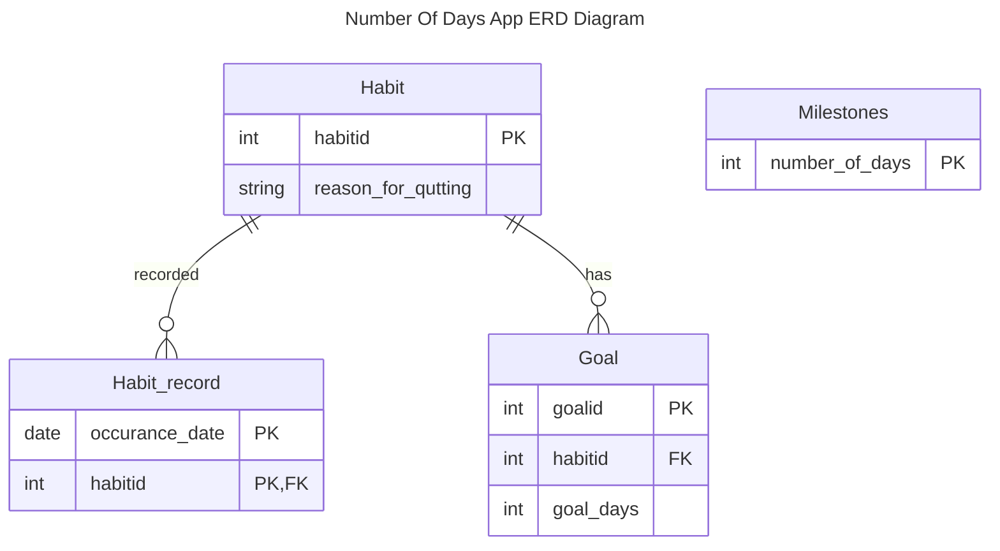

```mermaid
---
title: Number Of Days App ERD Diagram
---

erDiagram

Habit ||--o{ Habit_record : recorded
%% made with the intention to support > 1 goal per habit
Habit ||--o{ Goal : has
Milestones

    Habit {
        int habitid PK
        string reason_for_qutting

    }

    Goal {
        int goalid PK
        int habitid FK
        int goal_days
    }

    %% assumes once occurance of the habit a day
    Habit_record {
        date occurance_date PK
        int habitid PK, FK
    }

    Milestones {
        %% is simple, like 10, 30...
        int number_of_days PK
    }

```
